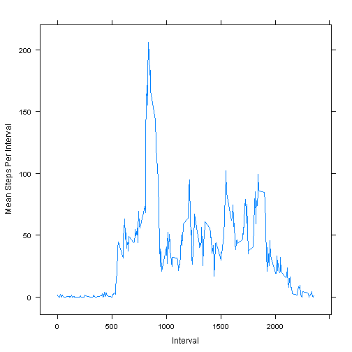

# Reproducible Research: Peer Assessment 1


## Part 0. Loading and preprocessing the data

The data is stored in a csv file, so `read.csv` is usd here.  
It is well formatted and I did not process it after reading the data into the _**activity**_ variable.


```r
if(!file.exists("activity.csv")) {
	unzip("activity.zip")	
}

activity <- read.csv("activity.csv", header=TRUE, colClasses=c("integer", "Date", "integer"))
```

## Part 1. What is mean total number of steps taken per day?

For this part, I need the help of `plyr` package.


```r
library(plyr)
```

The total number of steps taken each day is calculated with `ddply` and stored into _**spd**_ variable. 

I did not set `na.rm=TRUE` for `sum` function because otherwise the sum of `NA`s would turn to 0, which would be taken into the histogram later.


```r
## spd for Steps Per Day
spd <- ddply(activity, .(date), summarize, steps=sum(steps))

hist(spd$steps, main="Histogram of Total Number of Steps Taken Each Day", xlab="Steps Per Day", col=rgb(1,0,0,0.1))
```

 

The histogram shows as above.  

The mean and median are calculated without `NA` as below:


```r
spd.mean <- mean(spd$steps, na.rm=TRUE)
spd.mean
```

```
## [1] 10766
```

```r
spd.median <- median(spd$steps, na.rm=TRUE)
spd.median
```

```
## [1] 10765
```

As the output says:

* The mean total number of steps taken per day == 1.0766 &times; 10<sup>4</sup>.
* The median total number of steps taken per day == 10765.

## Part 2. What is the average daily activity pattern?

For this part, I need the help of `plyr` and `lattice` packages.


```r
library(plyr)
library(lattice)
```

To find the average daily activity pattern, I need to calculate the mean steps of every interval across all days. It is done with `ddply` and `summarize` functions.  

Then the pattern is drawn with `xyplot`.


```r
## mspi for Mean Steps Per Interval
mspi <- ddply(activity, .(interval), summarize, steps=mean(steps, na.rm=TRUE))

## plot(mspi$interval, mspi$steps, type="l", xlab="Interval", ylab="Mean Steps Per Interval")
xyplot(steps ~ interval, data = mspi, layout = c(1, 1), type = "l", xlab = "Interval", ylab = "Mean Steps Per Interval")
```

 

`which.max` is used to locate the interval which contains the maximum number of steps, on average across all the days in the dataset.


```r
maxStepIndex <- which.max(mspi$steps)
maxInterval <- mspi[maxStepIndex, ]$interval
maxInterval
```

```
## [1] 835
```

As the output says, the max interval is 835, i.e. from 08:35 to 08:40 during the day.

## Part 3. Imputing missing values

For this part, I need the help of `plyr` package.


```r
library(plyr)
```

To calculate the total number of missing values in the dataset, simply count the rows which cannot represent complete cases.


```r
isComplete <- complete.cases(activity)
nNaRows <- sum(!isComplete)
nNaRows
```

```
## [1] 2304
```

As the output says, the total number of rows with `NA`s is 2304.

The imputation is a little tricky, borrowd from the mailing thread [Re: [R] how to substitute missing values (NAs) by the group means](http://www.mail-archive.com/r-help@r-project.org/msg58289.html).   

The filling strategy is to replace `NA` with the mean step of the the very interval across all days.  

Then the NA-free dataset is stored into _**activity2**_ variable and the aggregated sums of steps is in _**spd2**_.


```r
impute <- function(x, fun, ...) {
  missing <- is.na(x)
  replace(x, missing, fun(x[!missing], ...))
}

activity2 <- ddply(activity, .(interval), transform, steps = impute(steps, mean))

## spd for Steps Per Day
spd2 <- ddply(activity2, .(date), summarize, steps=sum(steps))
```

Then make histogram again with the NA-free dataset:


```r
hist(spd2$steps, main="Histogram of Total Number of Steps Taken Each Day", xlab="Total Steps Per Day", col=rgb(0,0,1,0.1))
```

 

Compared along with the old one:


```r
p1 <- hist(spd2$steps, plot=FALSE)
p2 <- hist(spd$steps, plot=FALSE)

plot(p1, col=rgb(0,0,1,0.1), main="Histogram of Total Number of Steps Taken Each Day", xlab="Steps Per Day")
plot(p2, col=rgb(1,0,0,0.1), add=TRUE, main="Histogram of Total Number of Steps Taken Each Day", xlab="Steps Per Day")

legend("topright", c("After Imputation", "Before Imputation"), col=c(rgb(0,0,1,0.1), rgb(1,0,0,0.1)), lwd=10)
```

 

You can discover: 

* The `[0, 5000]`, `[5001, 10000]`, `[15001, 20000]`, `[20001, 25000]` sections are exactly overlapping, meaning that these parts of statistical results of the 2 data sets are identical. 
* The only difference occurs on `[10001, 15000]` section, with after-imputation data set exceeding the before-imputation one.

The mean and median total number of steps taken per day are also re-calculated:


```r
spd2.mean <- mean(spd2$steps, na.rm=TRUE)
spd2.mean
```

```
## [1] 10766
```

```r
spd2.median <- median(spd2$steps, na.rm=TRUE)
spd2.median
```

```
## [1] 10766
```

As the output says:

* The new mean total number of steps taken per day == 1.0766 &times; 10<sup>4</sup>.
* The new median total number of steps taken per day == 1.0766 &times; 10<sup>4</sup>.

Compared with the results from Part 1: 

* The old mean total number of steps taken per day == 1.0766 &times; 10<sup>4</sup>.
* The old median total number of steps taken per day == 10765.

It is obvious the fill-with-mean strategy does not affect the mean value, while the median is slightly changed.

## Part 4. Are there differences in activity patterns between weekdays and weekends?

For this part, I need the help of `lattice`, `lubridate` and `plyr` packages.  

In addition, I am a Chinese and my original `LC_TIME` is `"Chinese (Simplified)_People's Republic of China.936"`, which would affect the calculation of time, so I set `LC_TIME` to `"C"`.


```r
library(lattice)
library(lubridate)
library(plyr)
Sys.setlocale("LC_TIME", "C")
```

Here creates a new factor variable in the dataset with two levels – "weekday"" and "weekend" indicating whether a given date is a weekday or weekend day, with `wday` funtion from `lubridate` package.


```r
weekdays <- wday(activity2$date)
activity2$dtype <- ifelse(weekdays==1 | weekdays==6, "weekend", "weekday")
activity2$dtype <- factor(activity2$dtype)
```

Then make a 2-panel time series plot of the 5-minute interval and the average number of steps taken, averaged across all weekday days or weekend days. 


```r
## mspipt for Mean Steps Per Interval Per dayType
mspipt <- ddply(activity2, .(interval, dtype), summarize, steps=mean(steps))

xyplot(steps ~ interval | dtype, data = mspipt, layout = c(1, 2), type = "l", xlab = "Interval", ylab = "Mean Steps Per Interval")
```

 

From the plot above, you can discover, roughly:

* The trial objects walk more in weekday mornings than weekend mornings.
* The trial objects walk more in weekend noons than weekday noons.
